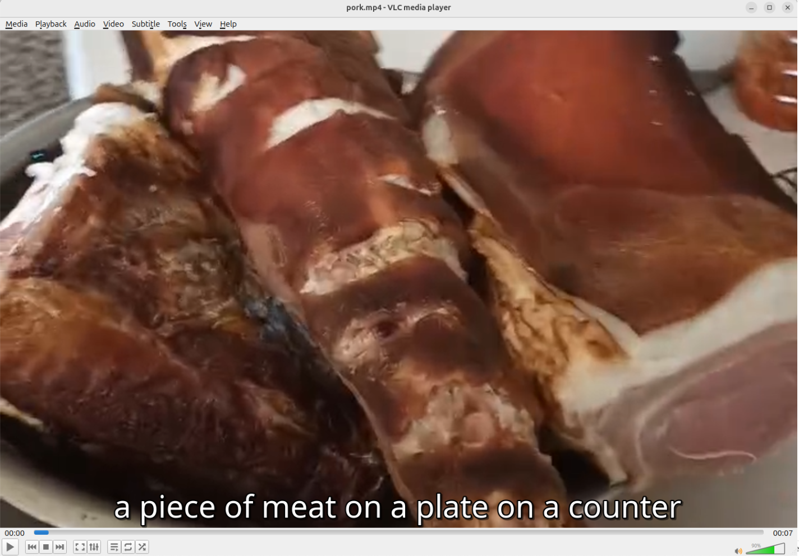

# ViT Captioner

A Python package for extracting keyframes from videos and generating captions using the ViT-GPT2 model.

[](https://badge.fury.io/py/vit-captioner)
[](https://opensource.org/licenses/MIT)



## Features

- Extract keyframes from videos using Katna or uniform sampling
- Generate captions for images using the ViT-GPT2 model
- Match keyframes with timestamps in a video
- Convert videos to SRT subtitle files with captions
- Visualize keyframes and timeline data
- Performance optimized with smart resource management
- Thread-safe image processing and visualization

## Installation

### Option 1: Install from PyPI (recommended)

```bash
pip install vit-captioner
```

### Option 2: Install from source

```bash
# Clone the repository
git clone https://github.com/lachlanchen/VideoCaptionerWithVit.git
cd VideoCaptionerWithVit

# Install the package in development mode
pip install -e .
```

### Option 3: Create and install a pip package

```bash
# Build the package
python setup.py sdist bdist_wheel

# Install the package
pip install dist/vit_captioner-0.1.*.tar.gz
```

### Environment Setup

For a complete environment with all dependencies, you can use the provided Conda environment:

```bash
# Create conda environment from the yaml file
conda env create -f env.yaml

# Activate the environment
conda activate caption
```

## Command Line Usage

### Extract keyframes from a video:
```bash
vit-captioner extract -V /path/to/video.mp4 -N 10 -v
```

### Generate caption for an image:
```bash
vit-captioner caption-image -I /path/to/image.jpg
```

### Convert video to captions:
```bash
vit-captioner caption-video -V /path/to/video.mp4 -N 10 -v
```
The `-v` flag enables verbose output with progress bars.

### Find matching timestamps for keyframes:
```bash
vit-captioner find-timestamps -V /path/to/video.mp4 -K /path/to/keyframes_folder -v
```

## Python API Usage

```python
from vit_captioner.keyframes.extractor import KeyFrameExtractor
from vit_captioner.captioning.image import ImageCaptioner
from vit_captioner.captioning.video import VideoToCaption

# Extract keyframes
extractor = KeyFrameExtractor("/path/to/video.mp4")
output_folder = extractor.extract_key_frames("/path/to/video.mp4", num_key_frames=10)

# Generate caption for an image
captioner = ImageCaptioner()
caption = captioner.predict_caption("/path/to/image.jpg")

# Convert video to captions
# Note: verbose flag enables progress bars
converter = VideoToCaption("/path/to/video.mp4", num_frames=10, verbose=True)
converter.convert()
```

## Output

- All outputs include timestamp suffixes for versioning
- Captioned images are saved alongside their original images
- SRT and JSON outputs for video captions
- Visualization outputs are automatically saved with their data
- Caption data is saved alongside captioned images for easy access

## Performance Optimizations

- Smart resource management with proper cleanup
- Single model loading for multiple frames (improved memory usage)
- Thread-safe image processing with error fallbacks
- Progress bars for tracking long-running operations
- Limited number of concurrent workers to prevent memory issues

## Requirements

- Python 3.6+
- OpenCV
- PyTorch
- Transformers
- Katna (for keyframe extraction)
- Matplotlib
- tqdm

## Testing

The package includes a comprehensive test script to verify functionality:

```bash
# Run the test script with performance metrics
python test_vit_captioner.py -V /path/to/test/video.mp4 -N 5 -v
```

The test script provides:
- Command-line interface testing
- Python API testing
- Caption quality metrics
- Performance comparison between CLI and API

You can test only the CLI or API by using the `--cli-only` or `--api-only` flags:

```bash
# Test only the CLI
python test_vit_captioner.py --cli-only -v

# Test only the API
python test_vit_captioner.py --api-only -v
```

## Demo

The package produces both SRT and JSON output files with timestamped captions. Here's a sample of the output:

### Sample SRT Output
```
1
00:00:00,000 --> 00:00:00,922
a piece of meat on a plate on a counter
2
00:00:00,922 --> 00:00:01,844
a piece of meat is being cooked in a pan
3
00:00:01,844 --> 00:00:02,766
a dog laying in a bathtub next to a bowl of food
```

### Sample JSON Output
```json
[
    {
        "start": "00:00:00,000",
        "end": "00:00:00,922",
        "text": "a piece of meat on a plate on a counter"
    },
    {
        "start": "00:00:00,922",
        "end": "00:00:01,844",
        "text": "a piece of meat is being cooked in a pan"
    }
]
```

The package also generates captioned images with the caption text displayed as a title.

## Acknowledgments

This project builds upon several excellent open source projects:

- [nlpconnect/vit-gpt2-image-captioning](https://huggingface.co/nlpconnect/vit-gpt2-image-captioning): The ViT-GPT2 model used for generating image captions
- [Katna](https://github.com/keplerlab/katna): Used for intelligent key frame extraction from videos
- [OpenCV](https://opencv.org/): For video processing and frame extraction
- [PyTorch](https://pytorch.org/) and [Transformers](https://huggingface.co/docs/transformers/index): For deep learning model inference

The key frame extraction technique uses a combination of:
- Content-aware frame extraction via Katna (primary method)
- Uniform sampling fallback when Katna extraction fails
- Smart timestamp matching for aligning frames with video timeline

## License

MIT